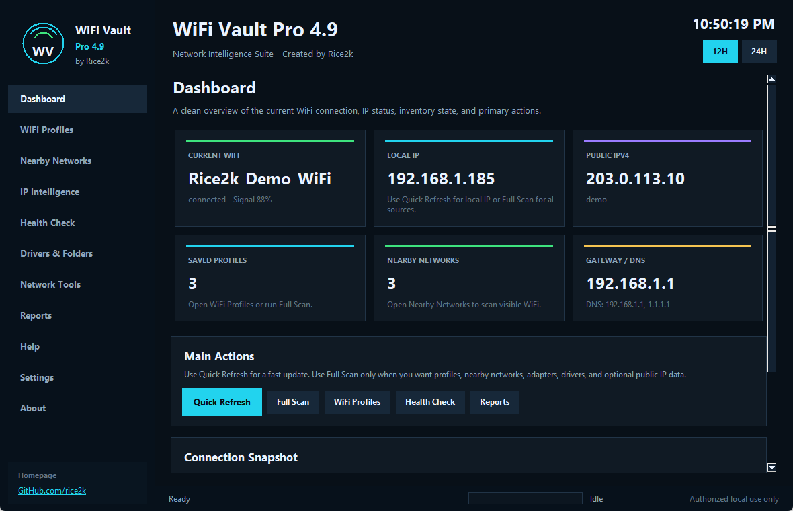
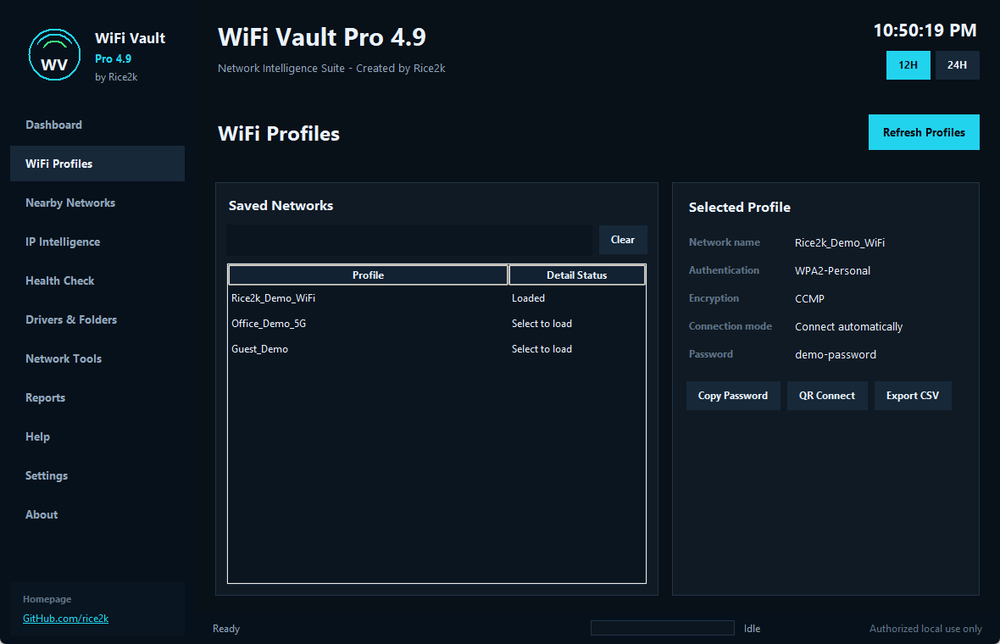
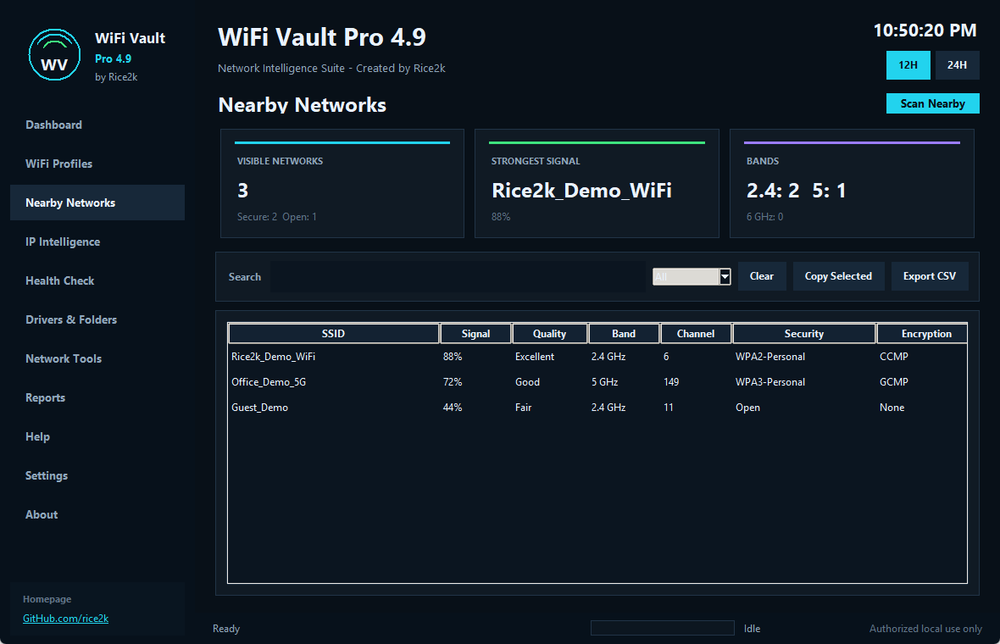
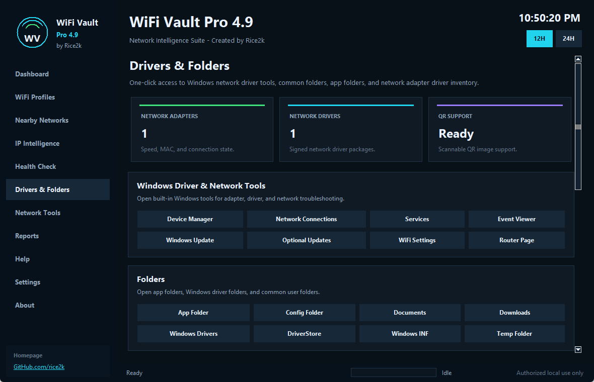
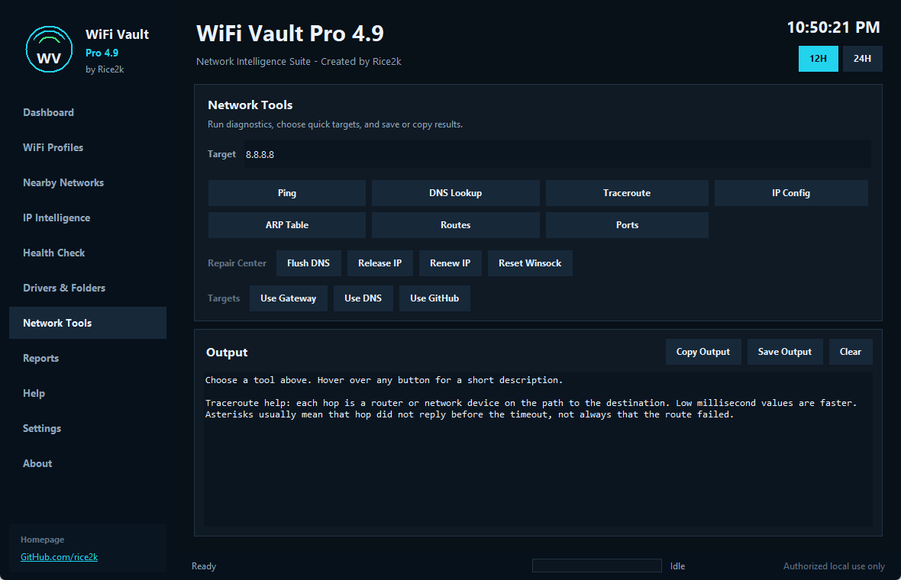

<p align="center">
  
</p>

<h1 align="center">WiFi Vault Pro 4.9</h1>

<p align="center">
  <strong>Network Intelligence Suite for Windows</strong><br>
  Created by <strong>Rice2k</strong>
</p>

<p align="center">
  <a href="https://github.com/rice2k/WiFi-Vault-Pro/releases/latest/download/WiFiVaultPro_Rice2k.exe"><strong>Download Windows EXE</strong></a>
  &nbsp;|&nbsp;
  <a href="https://github.com/rice2k/WiFi-Vault-Pro/releases/latest/download/WiFi_Vault_Pro_v4_9_Rice2k_Full_Package.zip"><strong>Full Package ZIP</strong></a>
  &nbsp;|&nbsp;
  <a href="https://github.com/rice2k/WiFi-Vault-Pro/releases/latest"><strong>Latest Release</strong></a>
  &nbsp;|&nbsp;
  <a href="https://github.com/rice2k"><strong>GitHub.com/rice2k</strong></a>
</p>

<p align="center">
  
  
  
  
</p>

## About

WiFi Vault Pro is a polished Windows desktop utility for local network visibility. It combines saved WiFi profile review, nearby WiFi scanning, multi-method IP detection, health checks, network tools, adapter and driver inventory, QR connection payloads, and exportable reports in one dark professional interface.

The app is designed for computers and networks you own or are authorized to manage. It runs local Windows commands and keeps password visibility local unless you choose to copy or export data.

## Download

| Download | Description |
| --- | --- |
| [WiFiVaultPro_Rice2k.exe](https://github.com/rice2k/WiFi-Vault-Pro/releases/latest/download/WiFiVaultPro_Rice2k.exe) | Standalone Windows executable. Download and run directly. |
| [Full Package ZIP](https://github.com/rice2k/WiFi-Vault-Pro/releases/latest/download/WiFi_Vault_Pro_v4_9_Rice2k_Full_Package.zip) | Complete package with EXE, source, scripts, docs, screenshots, tests, and README. |
| [Source ZIP](https://github.com/rice2k/WiFi-Vault-Pro/releases/latest/download/WiFi_Vault_Pro_v4_9_Rice2k_Source.zip) | Source package with Python file, scripts, README, and requirements. |
| [Latest Release](https://github.com/rice2k/WiFi-Vault-Pro/releases/latest) | Release notes and all downloadable assets. |

## What It Does

<table>
  <tr>
    <td width="50%" style="background:#081018;color:#eaf3ff;">
      <h3>Dashboard</h3>
      <p>Shows current WiFi, local IP, public IP when scanned, saved profile state, nearby scan state, gateway/DNS, and primary actions.</p>
    </td>
    <td width="50%">
      <h3>WiFi Profiles</h3>
      <p>Lists saved Windows WiFi profiles and shows authentication, encryption, connection mode, and password when Windows returns key content.</p>
    </td>
  </tr>
  <tr>
    <td>
      <h3>QR Connect</h3>
      <p>Creates standard WiFi QR payloads, copies SSID/password, downloads payload text, and downloads QR PNG images when optional QR support is installed.</p>
    </td>
    <td>
      <h3>Nearby Networks</h3>
      <p>Scans visible WiFi networks and compares signal, channel, band, authentication, encryption, and radio count with filtering and CSV export.</p>
    </td>
  </tr>
  <tr>
    <td>
      <h3>IP Intelligence</h3>
      <p>Uses socket route detection, hostname lookup, ipconfig parsing, PowerShell adapter IPs, gateway/DNS extraction, and optional public IP checks.</p>
    </td>
    <td>
      <h3>Health Check</h3>
      <p>Runs practical checks for local IP, gateway, DNS servers, gateway ping, DNS resolution, internet reachability, and public IP context.</p>
    </td>
  </tr>
  <tr>
    <td>
      <h3>Drivers & Folders</h3>
      <p>Opens Windows network tools/folders and shows adapter status plus signed network driver inventory. Full Scan now loads both adapters and drivers.</p>
    </td>
    <td>
      <h3>Network Tools</h3>
      <p>Runs Ping, DNS Lookup, Traceroute, IP Config, ARP Table, Routes, Ports, and Repair Center commands with copy/save output actions.</p>
    </td>
  </tr>
</table>

## Screenshots

| Dashboard | WiFi Profiles |
| --- | --- |
|  |  |

| Nearby Networks | Drivers & Folders |
| --- | --- |
|  |  |

| Network Tools | QR Connect |
| --- | --- |
|  |  |

## Fast Refresh Versus Full Scan

| Mode | Speed | Loads |
| --- | --- | --- |
| Quick Refresh | Fast | Current WiFi and local IP only. |
| Full Scan | Slower | WiFi profiles, nearby networks, interface data, IP data, adapter status, and signed network driver inventory. |

Public IPv4/IPv6 lookup is off by default because it can slow down local scans. Enable it in Settings when you want internet-facing IP context.

## File Information

| File | Purpose |
| --- | --- |
| `wifi_vault_pro.py` | Main desktop application. |
| `run_app.bat` | Starts the app from source. |
| `install_requirements.bat` | Installs optional QR/build dependencies. |
| `build_exe.bat` | Builds the standalone `.exe` with PyInstaller. |
| `requirements.txt` | Optional dependencies. |
| `tests/smoke_tests.py` | Regression smoke tests. |
| `docs/screenshots/` | GitHub screenshot assets. |

More detail is available in [docs/FILE_GUIDE.md](docs/FILE_GUIDE.md).

## Run From Source

Requirements:

- Windows 10 or Windows 11
- Python 3.10 or newer

Steps:

```powershell
py -3 wifi_vault_pro.py
```

Or double-click:

```text
run_app.bat
```

## Optional Dependencies

Optional dependencies enable QR image display, QR PNG download, and executable builds.

```powershell
py -3 -m pip install -r requirements.txt
```

Or double-click:

```text
install_requirements.bat
```

## Build The EXE

```powershell
py -3 -m PyInstaller --noconfirm --onefile --windowed --name "WiFiVaultPro_Rice2k" wifi_vault_pro.py
```

Or double-click:

```text
build_exe.bat
```

The executable is created at:

```text
dist\WiFiVaultPro_Rice2k.exe
```

## Test

```powershell
py -3 -m py_compile wifi_vault_pro.py
py -3 tests\smoke_tests.py
```

Validated areas:

- Python syntax compile check
- IPv4/IPv6 parsing regression checks
- Fast startup with no heavy auto-scan
- Quick Refresh
- Full Scan loading network drivers
- Empty adapter/driver result display
- All-page Tkinter render smoke test
- PyInstaller executable build

## Authorized Use

Use WiFi Vault Pro only on computers and networks you own or are authorized to manage. The app can display locally stored WiFi profile information when Windows returns it, so handle exports and screenshots carefully.

Reports hide loaded WiFi passwords by default. Public IP lookups are off by default and only run when enabled in Settings.

See [SECURITY.md](SECURITY.md) for more detail.

## License

MIT License. See [LICENSE](LICENSE).
